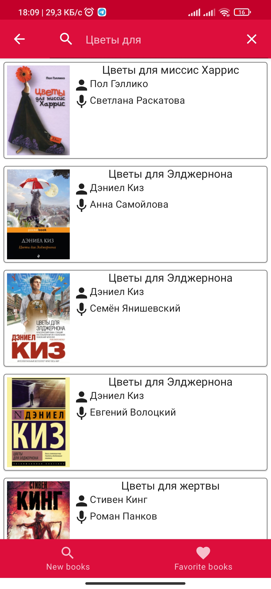
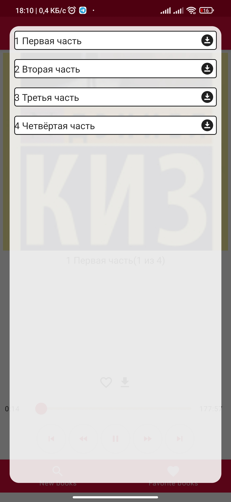

# VBook
An application for audiobooks lowers.

Existing features:
---------
- [x] Search and get new books from sites
- [x] Book playback
- [x] Book offline playback.
- [ ] Searching in different sources

Screenshots:
---------

 
 Details 

 
 
 
 

Used technologies:
---------
- Most of Jetpack libraries: ViewModel, Navigation, Room
- Kotlin Flow, Kotlin Coroutines
- Hilt
- Exoplayer
- Jetpack Compose
- JSoup
- MVVM Architecture + Clean Architecture
